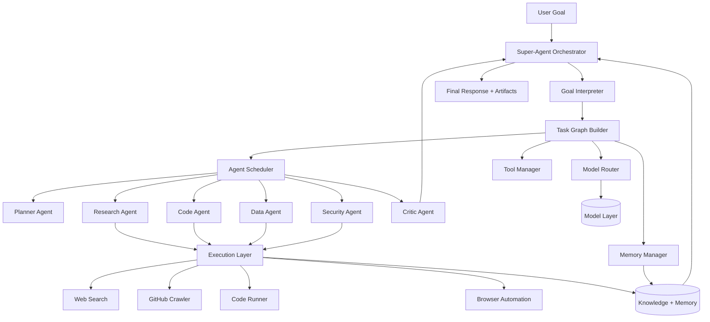

# Autonomous AI System Design + Super-Agent Architecture

This document adds a full blueprint for evolving this repository into a **super multi-agent autonomous AI system**.

---

## 1) Autonomous AI System Design (Layered)

```text
User
 │
 ▼
AI Interface Layer
(Chat / API / Voice)
 │
 ▼
AI OS Kernel
 │
 ├── Agent Scheduler
 ├── Task Graph Engine
 ├── Memory Manager
 ├── Tool Manager
 ├── Model Router
 │
 ▼
Agent Network
 │
 ├── Planner Agent
 ├── Research Agent
 ├── Code Agent
 ├── Data Agent
 ├── Security Agent
 ├── Critic Agent
 │
 ▼
Execution Layer
 │
 ├── Web Search
 ├── GitHub Crawler
 ├── Code Runner
 ├── Browser Automation
 │
 ▼
Knowledge + Memory Layer
 │
 ├── Vector DB
 ├── Document store
 ├── Agent memory
 │
 ▼
Model Layer
(Multiple AI models)
```

### Current repo mapping

| Blueprint block | Current files/modules in repo |
|---|---|
| AI Interface Layer | `api/server.js`, `dashboard/index.html` |
| AI OS Kernel | `kernel/agentScheduler.js`, `kernel/planner.js`, `kernel/executor.js`, `kernel/memoryManager.js` |
| Agent Network | `agents/researchAgent.js`, `agents/codingAgent.js`, `agents/toolAgent.js`, `agents/evaluationAgent.js` |
| Execution Layer | `tools/webSearch.js`, `tools/codeExecutor.js`, `tools/fileSystem.js`, `tools/apiCaller.js` |
| Knowledge + Memory Layer | `memory/vectorDB.js`, `memory/knowledgeGraph.js`, `memory/datasetStore.js`, `rag/embedder.js`, `rag/retriever.js` |
| Model Layer | `models/openai.js`, `models/claude.js`, `models/huggingface.js`, `models/ollama.js`, `models/index.js` |

---

## 2) Super-Agent AI Architecture

A **Super-Agent** is a single top-level orchestrator that converts goals into executable graph plans and delegates work to specialist agents.



### Super-Agent responsibilities

1. **Goal decomposition** into task graph (DAG).
2. **Agent assignment** based on capability and model/tool availability.
3. **Execution control** with retries, timeouts, and guardrails.
4. **Cross-agent memory synchronization**.
5. **Critic/evaluator feedback loop** before final answer.
6. **Cost/latency optimization** through model routing.

---

## 3) Runtime contract (proposed)

### Super-Agent input

```json
{
  "goal": "Build a secure market research report and code prototype",
  "constraints": {
    "deadline": "2h",
    "budgetUsd": 2.5,
    "maxTokens": 20000
  },
  "outputs": ["report", "code", "risk_assessment"]
}
```

### Super-Agent output

```json
{
  "status": "completed",
  "summary": "Research report, prototype code, and security review generated.",
  "artifacts": [
    {"type": "report", "path": "artifacts/report.md"},
    {"type": "code", "path": "artifacts/prototype.js"},
    {"type": "risk_assessment", "path": "artifacts/security.md"}
  ],
  "traceId": "run_12345"
}
```

---

## 4) Task Graph Engine design

Each node in the graph is an executable unit.

```ts
interface TaskNode {
  id: string;
  type: "plan" | "research" | "code" | "data" | "security" | "critic";
  deps: string[];
  input: Record<string, unknown>;
  agent: string;
  toolHints?: string[];
  modelHint?: string;
  retry?: { attempts: number; backoffMs: number };
  timeoutMs?: number;
}
```

Execution policy:

- Topological ordering with parallel execution for independent nodes.
- Persist intermediate outputs in memory store.
- Route failures to Critic Agent for self-heal strategy.

---

## 5) Agent roles in the super network

- **Planner Agent**: creates/updates DAG from goal.
- **Research Agent**: acquires external knowledge.
- **Code Agent**: generates code/tests/fixes.
- **Data Agent**: performs transformation, validation, analytics.
- **Security Agent**: threat modeling, policy checks, secret scanning.
- **Critic Agent**: scores outputs and requests revisions.

---

## 6) Implementation steps for this repo

1. Add `kernel/taskGraphEngine.js` to store/execute DAG nodes.
2. Add `kernel/modelRouter.js` for dynamic provider selection.
3. Add `kernel/toolManager.js` to centralize tool permissions and rate limits.
4. Add `agents/plannerAgent.js`, `agents/dataAgent.js`, `agents/securityAgent.js`, `agents/criticAgent.js` (or extend `evaluationAgent.js` as critic).
5. Add `tools/githubCrawler.js` and `tools/browserAutomation.js`.
6. Expand `memoryManager` with short-term per-run memory + long-term summaries.
7. Add trace logging per graph node for observability.

---

## 7) Safety and governance defaults

- Tool allowlist by agent role.
- Max execution depth to avoid recursive runaway.
- Prompt/response PII redaction pipeline.
- Security Agent gate for any code execution request.
- Critic score threshold required before marking run complete.

---

## 8) Minimal orchestration loop (pseudocode)

```js
const plan = await plannerAgent.createGraph(goal, memory);

for (const node of taskGraphEngine.topological(plan)) {
  await scheduler.waitForDeps(node.deps);

  const model = modelRouter.select(node, constraints);
  const tools = toolManager.bind(node.agent, node.toolHints);

  const result = await scheduler.runNode({ node, model, tools, memory });
  await memoryManager.save(node.id, result);

  const critique = await criticAgent.review(node, result);
  if (!critique.pass) {
    await scheduler.requeue(node, critique.repairPlan);
  }
}

return memoryManager.buildFinalResponse();
```

---

## 9) What this gives you

- True autonomous workflow execution (not just one-shot prompts).
- Modular specialist-agent collaboration.
- Pluggable models/tools per task.
- Auditable execution traces and reproducible runs.
- Safer output through security + critic gates.
